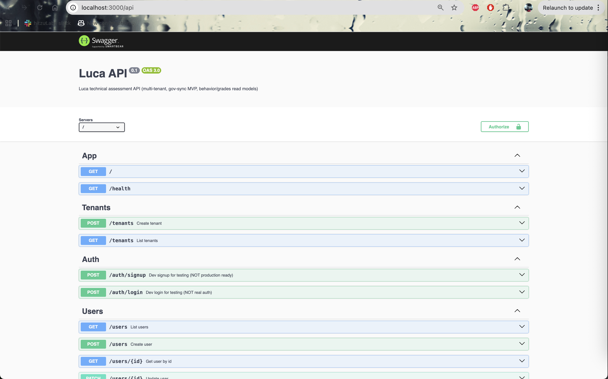
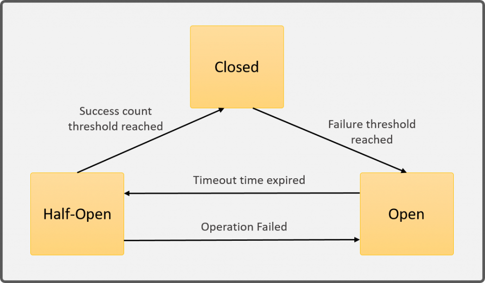

# Luca — Technical Assessment (Diseño + MVP de resiliencia Gov Sync)

Este repositorio es una implementación **PoC** que acompaña el diseño del sistema pedido en el hoe assessment y perfil de comportamiento por estudiante, en un contexto multi-tenant con control de acceso y trazabilidad.

El foco del MVP mostrado aquí es la integración resiliente con el "Government API" (mock incluido) y, en particular, el **circuit breaker por tenant** como protección ante fallas/latencias típicas de integraciones gubernamentales.

---

## Documentación (diseño)

- [Diseño del sistema](./docs/SYSTEM_DESIGN.md) — arquitectura, flujos write/read/sync, latencia, operación.
- [Modelo de datos](./docs/DATA_MODEL_DESIGN.md) — tablas, índices, multi-tenant y trazabilidad.
- [API Reference](./API.md) — endpoints.
- [Testing](./TESTING.md) — estrategia de pruebas.

---

## Stack tecnológico

- **Runtime / Framework**: [NestJS](https://nestjs.com/)
- **DB**: PostgreSQL (Docker Compose)
- **ORM**: TypeORM
- **Package manager**: `pnpm`
- **API docs**: Swagger en `/api`
- **Tests**: Jest

---

## Cómo levantar el proyecto (local)

### Prerrequisitos

- Docker y Docker Compose
- Node.js (compatible con NestJS)
- `pnpm` instalado globalmente

### 1) Levantar PostgreSQL

Este repo trae dos bases:
- **dev** en el puerto `57432`
- **test** en el puerto `57433`

```bash
docker compose up -d postgres-dev postgres-test
```

### 2) Instalar dependencias

```bash
pnpm install
```

### 3) Migraciones (dev)

Nota: si no seteas `NODE_ENV`, el sistema asume `local`.

```bash
export NODE_ENV=local
pnpm run db:run
```

### 4) Configurar env vars mínimas

El cliente de gobierno necesita el dato `GOV_API_BASE_URL`. Para el demo, lo apuntamos al mock dentro de la misma app:

```bash
export GOV_API_BASE_URL="http://localhost:3000/__mock/gov-api"
```

Opcionales (para ver el breaker actuar rápido):
- `GOV_API_TIMEOUT_MS` (default interno razonable)
- `GOV_API_CB_FAILURE_THRESHOLD` (default: `3`)
- `GOV_API_CB_OPEN_MS` (default: `5000`)

Ejemplo:

```bash
export GOV_API_TIMEOUT_MS="75"
export GOV_API_CB_FAILURE_THRESHOLD="2"
export GOV_API_CB_OPEN_MS="150"
```

Estos datos estan mostrados en el .env.example

### 5) Correr la API

```bash
pnpm dev
```

Swagger: `http://localhost:3000/api`



---

## MVP: Gov Sync + Circuit Breaker (por qué existe y cómo probarlo)

### ¿Qué problema se esta resolviendo?

Integraciones con APIs gubernamentales suelen presentar:
- timeouts y latencias impredecibles,
- ventanas de degradación/intermitencia,
- límites estrictos de rate/infra variable,
- necesidad de terminar procesos batch sin "tumbar" el sistema interno.

Por eso este MVP incluye un circuit breaker por tenant en `GovApiClient`:
- **CLOSED**: opera normal.
- **OPEN**: falla rápido y evita golpear la api de gobierno durante una ventana de enfriamiento.
- **HALF_OPEN**: permite un “probe” controlado para decidir si se recuperó.



Esto protege:
- latencia del sistema interno,
- la BD (evita cascadas de retries y saturación),
- y reduce carga hacia el API externo cuando ya está degradado.

<<<captura de pantalla de los estados del circuit breaker (CLOSED/OPEN/HALF_OPEN) en el endpoint DEV>>>

---

## Demo rápida (cURL)

### 0) Crear tenant

```bash
TENANT_ID=$(
  curl -s -X POST "http://localhost:3000/tenants" \
    -H "content-type: application/json" \
    -d '{"name":"School Demo"}' \
  | node -pe "JSON.parse(fs.readFileSync(0,'utf8')).id"
)
echo "TENANT_ID=$TENANT_ID"
```

### 1) Dev signup (crea usuario + token DEV)

```bash
TOKEN=$(
  curl -s -X POST "http://localhost:3000/auth/signup" \
    -H "content-type: application/json" \
    -d "{\"tenantId\":$TENANT_ID,\"email\":\"admin@school.edu\",\"fullName\":\"Admin\",\"role\":\"ADMIN\"}" \
  | node -pe "JSON.parse(fs.readFileSync(0,'utf8')).token"
)
echo "TOKEN=$TOKEN"
```

### 2) Mock Gov API: modo ok

```bash
curl -s -X POST "http://localhost:3000/__mock/gov-api/mode" \
  -H "content-type: application/json" \
  -d '{"mode":"ok"}' >/dev/null
```

### 3) Crear job de gov-sync

```bash
JOB_ID=$(
  curl -s -X POST "http://localhost:3000/tenants/$TENANT_ID/gov-sync/jobs" \
    -H "authorization: Bearer $TOKEN" \
    -H "content-type: application/json" \
    -d '{"periodId":"2025-Q1"}' \
  | node -pe "JSON.parse(fs.readFileSync(0,'utf8')).jobId"
)
echo "JOB_ID=$JOB_ID"
```

### 4) Procesar job

```bash
curl -s -X POST "http://localhost:3000/tenants/$TENANT_ID/gov-sync/jobs/$JOB_ID/process" \
  -H "authorization: Bearer $TOKEN" | cat
```

### 5) Ver estado del job

```bash
curl -s "http://localhost:3000/tenants/$TENANT_ID/gov-sync/jobs/$JOB_ID" \
  -H "authorization: Bearer $TOKEN" | cat
```

---

## Simular degradación y ver el circuit breaker

### 1) Poner el mock en modo fail o timeout

```bash
curl -s -X POST "http://localhost:3000/__mock/gov-api/mode" \
  -H "content-type: application/json" \
  -d '{"mode":"fail"}' >/dev/null
```

o:

```bash
curl -s -X POST "http://localhost:3000/__mock/gov-api/mode" \
  -H "content-type: application/json" \
  -d '{"mode":"timeout"}' >/dev/null
```

### 2) Reintentar /process y observar OPEN + fail-fast

Tip: baja `GOV_API_CB_FAILURE_THRESHOLD` a `2` para que abra rápido.

```bash
curl -s -X POST "http://localhost:3000/tenants/$TENANT_ID/gov-sync/jobs/$JOB_ID/process" \
  -H "authorization: Bearer $TOKEN" >/dev/null
curl -s -X POST "http://localhost:3000/tenants/$TENANT_ID/gov-sync/jobs/$JOB_ID/process" \
  -H "authorization: Bearer $TOKEN" >/dev/null
```

### 3) Consultar el estado del breaker (endpoint DEV)

```bash
curl -s "http://localhost:3000/tenants/$TENANT_ID/gov-sync/__dev/gov-api/circuit" \
  -H "authorization: Bearer $TOKEN" | cat
```

<<<captura de pantalla de /tenants/:tenantId/gov-sync/__dev/gov-api/circuit mostrando OPEN/HALF_OPEN/CLOSED>>>

---

## Bruno (colección lista para usar)

Si quieres correr el demo sin copiar/pegar cURLs, usa la colección de Bruno:

- **Colección**: `collection-luca/bruno.json`
- **Environment (local)**: `collection-luca/environments/local.bru`

Requests clave (archivos `.bru`):

- **Auth**
  - `collection-luca/auth/signup.bru`
  - `collection-luca/auth/login.bru`
- **Tenants**
  - `collection-luca/tenant/create.bru`
  - `collection-luca/tenant/get.bru`
- **Gov Sync**
  - `collection-luca/gov-sync/create job.bru`
  - `collection-luca/gov-sync/trigger processing.bru`
  - `collection-luca/gov-sync/get job.bru`
  - `collection-luca/gov-sync/gov-api-client-dev/circuit status.bru`
- **Mock Gov API**
  - `collection-luca/gov-sync/mock-gov-api/set mode ok.bru`
  - `collection-luca/gov-sync/mock-gov-api/set mode fail.bru`
  - `collection-luca/gov-sync/mock-gov-api/set mode timeout.bru`

<<<captura de pantalla de Bruno: importar carpeta collection-luca y ejecutar create job / trigger processing>>>

---

## Tests

```bash
pnpm test
pnpm test:gov-sync
pnpm test:e2e
```

Notas:
- En tests se usa `NODE_ENV=test` automáticamente (scripts), con DB `luca_test` (puerto `57433`) y `dropSchema` habilitado.

---

## ¿Se entiende el propósito del MVP?

Sí: el MVP está diseñado para demostrar (de forma verificable) la parte más “riesgosa” del assessment: **integración externa resiliente** (idempotencia/retries/limitación + protección operativa con circuit breaker) sin perder trazabilidad ni multi-tenancy.
